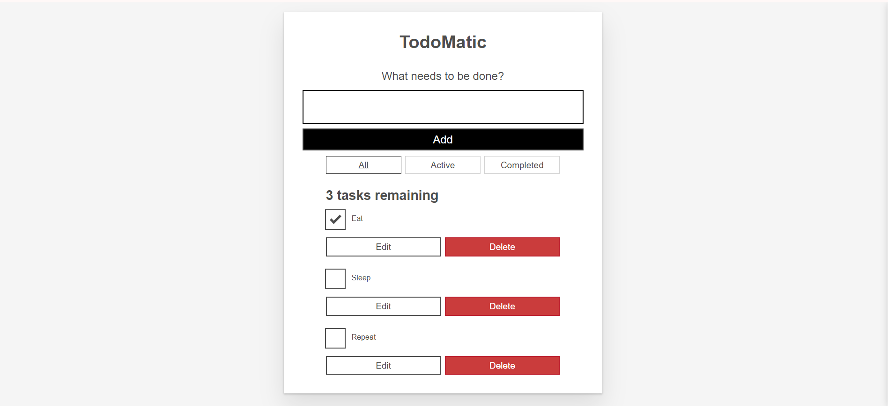
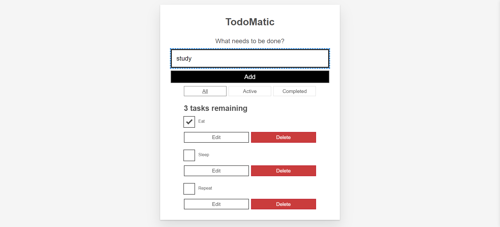

# Todolist Application in React
This todolist app is built on react and helps users track their tasks.

## Deployed Application
The application is deployed using Vercel
Link- https://todolist-app-react-kohl.vercel.app/

Application home screen

Input field to add new tasks

Three different tabs for tracking the Active and Completed separately or together
